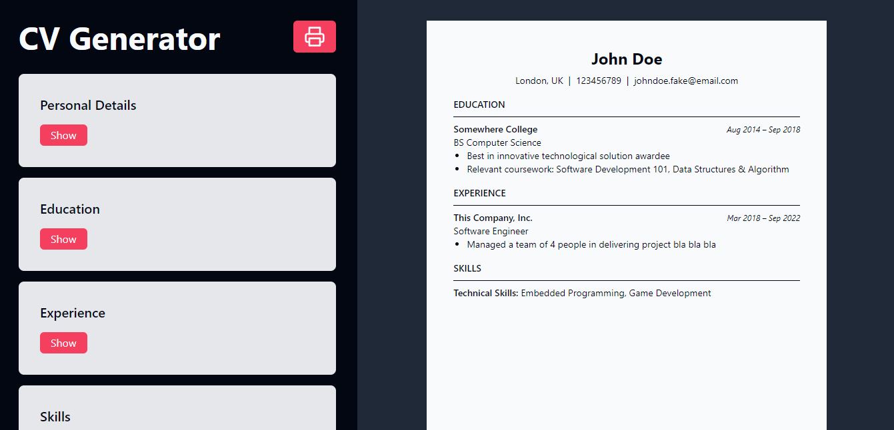

# CV Generator App

## Description

A basic resume generator where the user can add their personal details, education background, work experience, and skills. Also there is a print functionality so that the user can save/download the resume.

## Tech Stack

This is purely front end project so the tech stack is:

- ReactJS
- TailwindCSS
- Vite

## How it works

When the page is initially loaded, the image below is the page that will be displayed by the browser.

In the right side, is the preview, in the left is the editor section. There is already predefined input as seen in the preview, but the user can edit it in the editor. Also at the top is the print button and logo name. The print button functionality is implemented only using css and some javascript. When the print button is clicked, a local print modal will appear to allow the user to save as pdf or print the content. It will only print the preview page in default size of ISO-A4 with 1-inch margin on all side.

## What I learned

From this project, I learned about the react components - how to use it and how it works. I also learned about state management, hooks, the usage of key, and rendering.

## Attribution

The icons used in this project is from <a href="https://feathericons.com/">Feather Icons</a>
